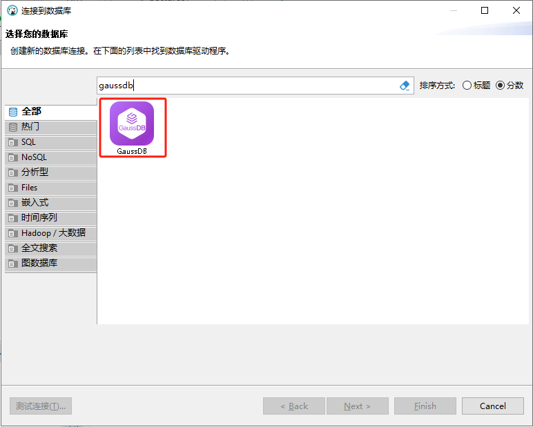

  

    <a href="README.md"><strong>简体中文</strong></a> | <strong>English</strong>
  

# GaussDB Database Driver

## 1 Overview
This guide provides instructions on setting up and using GaussDB within DBeaver.

DBeaver provides extensive support for GaussDB but may not cover all possible features. If DBeaver lacks a feature you need, please submit a request via our [GitHub page](https://github.com/dbeaver/dbeaver/issues/new/choose). If you are a developer, you may choose to enhance DBeaver's functionality by contributing your own code. For guidance on how to do this, see our [Contribution Guide](https://dbeaver.com/docs/dbeaver/Contribute-your-code/). Before starting, you must create a connection in DBeaver and select GaussDB. If you haven't done this yet, please refer to our [Database Connections](https://dbeaver.com/docs/dbeaver/Create-Connection/) article.
DBeaver uses dedicated drivers to interact with GaussDB servers; you must select the appropriate driver in the "Connect to Database" dialog.

## 2 Configuration  
This section outlines settings for establishing **direct connections** in DBeaver, configuring secure connections via **SSH/Proxy**, and JDBC driver setup **specifically for GaussDB**.  

### 2.1 GaussDB Connection Configuration  
This subsection outlines settings for establishing **direct connections** to GaussDB databases using DBeaver. Proper configuration ensures **seamless interaction** between DBeaver and your GaussDB database.  

1. The first page of connection settings requires you to specify values for specific fields to establish the initial connection.

| Field  | Description  |
| --- | --- |
| **Connection Type (Host/URL)** | Select whether to connect via host or URL. |
| **URL** | If connecting via URL, enter your GaussDB database URL here. This field hides when using host connection. |
| **Host** | If connecting via host, enter your GaussDB database host address here. |
| **Database** | Enter the name of the target GaussDB database. |
| **Port** | Enter your GaussDB database port number. Default port is `8000`. |
| **Authentication** | Select authentication type for this connection. For details, see: - [Database Native Authentication](https://dbeaver.com/docs/dbeaver/Authentication-Database-Native/) - [PostgreSQL PgPass Authentication](https://dbeaver.com/docs/dbeaver/Authentication-PostgreSQL-Pgpass/) |
| **Connection Details** | Provide additional [connection details](#211-连接详情) if required. |
| **Driver Name** | Automatically populated based on selected driver type. |
| **Driver Settings** | Configure any [driver-specific settings](#22-驱动程序属性) here. | 

2. The second page of connection settings provides additional options to further customize your connection to the GaussDB database.

| Field | Description |
| --- | --- |
| **Show Template Databases** | Display template databases. Available when **Show All Databases** is checked. |
| **Show Unconnectable Databases** | Display databases that cannot be connected to in the database list. Available when **Show All Databases** is checked. |
| **Show Database Statistics** | Display database statistics. |
| **Read All Data Types** | Read all data types (including arrays) from the server. |
| **Read Table Keys & Columns Simultaneously** | Enable reading table constraints during column reading to ensure accurate key identification. Note: May impact metadata loading performance. |
| **Replace legacy timezone** | Replace legacy timezone settings. Enable only when connecting to legacy timezones like **Europe/Kyiv** or **Asia/Calcutta**. Only these two timezones are affected. |
| **Display `$$` Quotes As** | Render `$$` quotes as code blocks or strings. |
| **Display `$tagName$` Quotes As** | Render `$tagName$` quotes as code blocks or strings. |
| **Use Prepared Statements** | Use prepared statements for SQL execution.  | 

#### 2.1.1 Connection Details  
The **Connection Details** in DBeaver allow further customization of your connection to the GaussDB database. This includes options to adjust **Navigator Settings**, configure **Security Restrictions**, apply **Filters**, set up **Connection Initialization**, and define **Shell Commands**. Each of these settings may significantly impact your database operations and workflow. For detailed guides, see:  

- [Connection Details Configuration](https://dbeaver.com/docs/dbeaver/Create-Connection/)  
- [Database Navigation](https://dbeaver.com/docs/dbeaver/Database-Navigator/)  
- [Security Settings Guide](https://dbeaver.com/docs/dbeaver/Managing-security-restrictions-for-database-connection/)  
- [Filter Configuration Guide](https://dbeaver.com/docs/dbeaver/Configure-Filters/)  
- [Connection Initialization Guide](https://dbeaver.com/docs/dbeaver/Configure-Connection-Initialization-Settings/)  
- [Shell Commands Guide](https://dbeaver.com/docs/dbeaver/Working-with-Shell-Commands-in-DBeaver/)  

### 2.2 Driver Properties
The **Driver Properties** settings for GaussDB allow you to fine-tune the performance of the GaussDB JDBC driver. These adjustments impact the efficiency, compatibility, and functionality of your GaussDB database connection.

For comprehensive guidance on configuring GaussDB JDBC driver properties, refer to the [GaussDB JDBC Official Documentation](https://support.huaweicloud.com/centralized-devg-v8-gaussdb/gaussdb-42-0065.html). These resources detail driver attributes and optimization techniques for GaussDB connections.

You can customize the GaussDB driver in DBeaver through the **Edit Driver 'GaussDB'** page. Access this page by clicking the **Edit Driver Settings** button on the first page of database connection settings. This interface provides configuration options that directly impact GaussDB database connections. For a comprehensive guide to these settings, refer to our [Database Drivers](https://dbeaver.com/docs/dbeaver/Database-drivers/) documentation.

### 2.3 Secure Connection Configuration
DBeaver supports establishing secure connections to your GaussDB database. Comprehensive guides for configuring these connections—particularly SSH and Proxy tunnels—are available in various reference articles. For detailed implementation, refer to:

- [SSH Tunnel Configuration](https://dbeaver.com/docs/dbeaver/SSH-Configuration/)
- [Proxy Configuration](https://dbeaver.com/docs/dbeaver/Proxy-configuration/)

## 3 Using GaussDB with DBeaver
DBeaver delivers extensive capabilities for GaussDB database operations. This includes schema exploration tools and specialized features designed to optimize developer workflows.  

### 3.1 GaussDB Database Objects
DBeaver enables comprehensive viewing and manipulation of diverse GaussDB database objects. It provides extensive support for GaussDB metadata types, allowing interaction with objects such as:  

- Databases
    - Schemas
        - Tables
            - Columns  
            - Constraints  
            - Foreign Keys 
            - Indexes  
            - Dependencies  
            - References  
            - Triggers  
            - Rules  
        - External Tables
        - Views
        - Indexes
        - Stored Procedures
        - Functions
        - Sequences
        - Data Types
        - Aggregate Functions
    - Storage
        - Tablespaces  
    - Roles
- Administration
    - Jobs (requires pgAgent)
    - Session Manager

For practical guidance on creating new tables and managing GaussDB objects, see our [Tutorial](https://dbeaver.com/docs/dbeaver/New-Table-Creation/).  

### 3.2 GaussDB Features in DBeaver
DBeaver extends beyond standard SQL operations, offering unique capabilities specifically designed for GaussDB. In addition to standard SQL functions, it provides specialized GaussDB features such as:

| Category | Feature |
| ---- | ---- |
| Data Types | GaussDB Arrays GaussDB Composite Types |
| Security | GaussDB Privileges GaussDB Roles |
| Database Management | GaussDB Dependencies |
| External Data | GaussDB Foreign Tables |

Additionally, DBeaver supports these compatible features not exclusive to GaussDB:

| Category | Feature |
| ---- | ---- |
| Data Transfer | [Data Import](https://dbeaver.com/docs/dbeaver/Data-import/) [Data Export](https://dbeaver.com/docs/dbeaver/Data-export/) |
| Session Management | [Session Manager](https://dbeaver.com/docs/dbeaver/Session-Manager-Guide/) |
| Schema Management | [Schema Comparison](https://dbeaver.com/docs/dbeaver/Schema-compare/) |
| Data Visualization | [Entity Relationship Diagrams (ERD)](https://dbeaver.com/docs/dbeaver/ER-Diagrams/) | 
